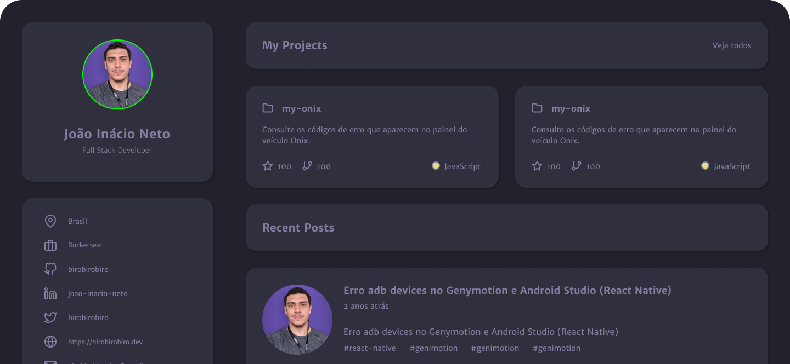

<h1 align="center">
   <p>Portfolio Github</p>
</h1>

<p align="center">
 <a href="#-funcionalidades">Funcionalidades</a> •
 <a href="#-layout">Layout</a> • 
 <a href="#-guia-de-estilo">Guia de estilo</a> • 
 <a href="#-tecnologias">Tecnologias</a> • 
 <a href="#autor">Autor</a>
</p>

<h4 align="center"> 
	🎉  GithubSearch - Concluído  🎉
</h4>

##  Sobre
Página web desenvolvida para ser utilizada como portfólio e currículo, utilizando os dados da API do Github.

##  Carcterísticas

- Design responsivo
- Uso da API do Github
- Cards dos projetos clicáveis, direcionando ao repositório específico.
- Light Mode

##  Tecnologias

As seguintes ferramentas foram usadas na construção do projeto:

- [HTML](https://expo.io/)
- [CSS](https://nodejs.org/en/)
- [Javascript](https://pt-br.reactjs.org/)

##  Layout
O layout da aplicação está disponível no Figma:

<a href="https://www.figma.com/file/EYimYoWWhNVjDZdc0zv1Vw/DD-Portfolio-Copy?fuid=1100112420700070907">
  
</a>

<p style="display: flex; align-items: flex-start; justify-content: left;">
  
</p>

## 🎨 Guia de estilo

### Cores:
```css
:root {
  --body-bg-color: #22212c;
  --text-color: #837e9f;
  --bg-cards: #302f3d;
  --bg-techs: #cb92b1;
  --container-margin: 20px 40px;
}
```
### Tipo de Fonte:

- font-family: Merriweather Sans 

- font-weight: 400, 500 e 700

<a href="https://www.figma.com/file/EYimYoWWhNVjDZdc0zv1Vw/DD-Portfolio-Copy?fuid=1100112420700070907">
  
</a>

## 🦸 Autora

<a href="https://blog.rocketseat.com.br/author/thiago/">
 
 <br />
 <sub><b>Tayanna Amorim</b></sub></a> <a href="https://www.linkedin.com/in/tayanna-amorim-98161623b/" title="tayanna"></a>
 <br />

<br />

[](https://www.linkedin.com/in/tayanna-amorim-98161623b/) 
[](mailto:amorim.tayanna@gmail.com)
